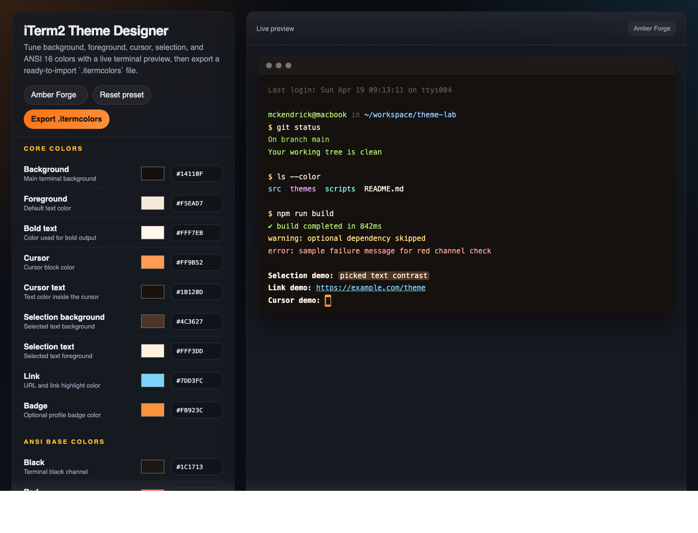

# iTerm2 Theme Designer

A lightweight browser-based tool for designing iTerm2 color themes with a live terminal preview and one-click `.itermcolors` export.

No build step. No dependencies. Open the file and start tuning colors.

Live URL: https://iterm2-theme-designer.mckendrick9888.workers.dev/

Cloudflare Web Analytics: enabled



## Analytics

This project is prepared for Cloudflare Web Analytics.

There are two supported ways to enable it:

1. Cloudflare dashboard automatic setup
2. Manual beacon setup with a site token

### Automatic setup on Cloudflare Pages

Cloudflare documents a one-click path for Pages projects:

1. Open `Workers & Pages`
2. Select the project
3. Open `Metrics`
4. Enable `Web Analytics`

Cloudflare will inject the beacon automatically on the next deployment.

### Manual setup with a token

If you prefer manual control, this project includes a token hook in [index.html](./index.html).

Set the value of:

```html
<meta name="cf-web-analytics-token" content="3fc821bf50f6489bbc558fad07a827e7">
```

to the token Cloudflare gives you from `Web Analytics → Add a site / Manage site`.

Once the token is set and deployed, the page will load Cloudflare's beacon script automatically.

## Features

- Live preview for background, foreground, bold text, cursor, selection, and link colors
- Full ANSI 16-color palette editor
- Built-in starter presets
- Hex input plus native color picker controls
- Direct export to iTerm2 `.itermcolors` format
- Fully static single-file app that runs locally in any modern browser

## Demo

Open `index.html` in your browser.

On macOS:

```bash
open index.html
```

## Live Deployment

This project can be deployed as a static site on any free static host, including:

- GitHub Pages
- Cloudflare Pages
- Vercel

Because the app is a single static HTML file, no build command is required.

### GitHub Pages

This repository includes a GitHub Actions workflow that deploys the site on every push to `main`.

After enabling Pages in the repository settings, the site will be available at:

```text
https://<your-github-username>.github.io/iterm2-theme-designer/
```

### Cloudflare Pages

- Import the GitHub repository into Cloudflare Pages
- Build command: leave empty
- Output directory: `.`

Current deployment:

```text
https://iterm2-theme-designer.mckendrick9888.workers.dev/
```

### Vercel

- Import the GitHub repository into Vercel
- Framework preset: `Other`
- Build command: leave empty
- Output directory: `.`

## How To Use

1. Open `index.html`.
2. Pick a preset or start adjusting colors manually.
3. Use the live preview to validate contrast and tone.
4. Click `Export .itermcolors`.
5. In iTerm2, go to `Profiles → Colors → Color Presets → Import`.
6. Select the exported file and apply it to your profile.

## Project Structure

```text
.
├── index.html
├── LICENSE
└── README.md
```

## Why This Exists

iTerm2 theme creation is usually spread across plist files, JSON snippets, screenshots, and trial-and-error imports. This project keeps the loop short: adjust colors, preview the terminal, export the theme, and import it immediately.

## Customization

If you want to extend the app, the easiest starting points are:

- Add more built-in presets in the `presets` object
- Expand the preview content in `renderScreen()`
- Add import support for existing `.itermcolors` files
- Add theme name editing before export

## License

MIT
